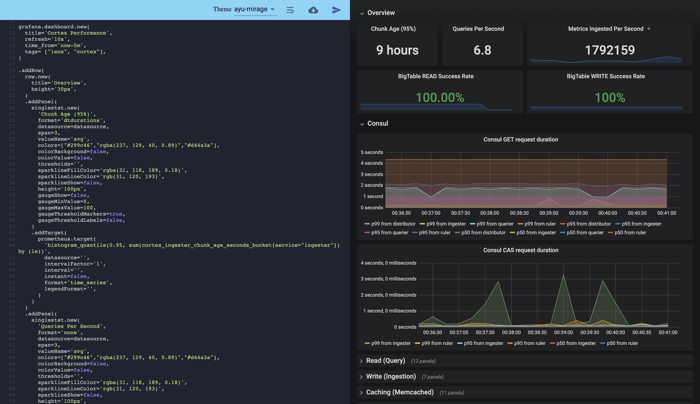

# Grafonnet Playground
Playground for grafanna with jsonnet. Allows users to write [grafonnet](https://github.com/grafana/grafonnet-lib) and see the rendered [grafana](https://grafana.com/) dashboard.



## Usage

Run using dockerhub image (note the variables in the command)

```
docker run \
    -e "GRAFANA_API_KEY=${grafana_api_key}" \
    -e "GRAFANA_GET_URL=${grafana_url}" \
    -e "GRAFANA_POST_URL=${grafana_url}" \
    -e "GRAFONNET_PLAYGROUND_FOLDER_ID=${grafana_playground_folder_id}" \
    -e "GIN_MODE=release" \
    -p 8080:8080 \
    lahsivjar/grafonnet-playground
```

*Note*: For debugging remove the `GIN_MODE` environment variable from above command

## Cleaning up dashboards created by playground

From version 1.0.0, grafonnet-playground allows automatically cleaning up the dashboards that were created. This can be configured via `AUTO_CLEANUP` config and can be further tuned via other available configuration. For a list of all configurations please check [application.yml.sample](application.yml.sample) file.

*Note*: Even when the dashboard is deleted after it has been rendered, it will continue to work and display data.

## Development build
- Copy config file
```
make copy-config
```
- Update properties in the file `application.yml`
- Build code
```
make build-dev
```
- Execute go binary
```
./out/grafonnet-playground
```
